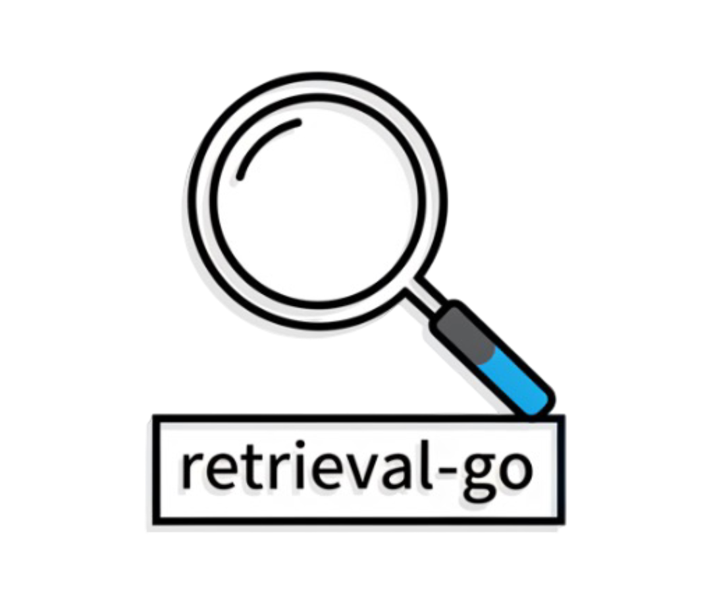

<p align="center">
  
</p>

# retrieval-go

A fast, batteries-included web retrieval library for Go.

`retrieval-go` is a production-oriented DuckDuckGo HTML search client + web page content extractor designed for building LLM tools (RAG, agents, “browse the web” features) without relying on paid search APIs.

It provides:

- Search (`query -> []Page`) using DuckDuckGo’s Lite HTML endpoint.
- Content extraction (`url -> Document`) powered by [`go-readability`](https://github.com/go-shiori/go-readability).
- Robust defaults (headers, user-agent selection, decompression, timeouts).
- A configurable `Config` API plus ergonomic `Option` helpers.

---

## Why

Most LLM applications need three things from “internet access”:

- **Discover** relevant URLs for a query.
- **Fetch & extract** clean, readable text.
- **Keep it reliable** (timeouts, gzip/br/zstd, sane defaults).

`retrieval-go` is built specifically for that workflow.

---

## Features

- **DuckDuckGo Lite HTML search** (works without browser automation)
- **Clean text extraction** (title + plain text + canonical URL)
- **Automatic decompression** (`gzip`, `br`, `zstd`, `deflate`)
- **Production defaults**
  - request headers close to a real browser
  - error-body capture with size limit
- **Extensible parsing** via `Parser` interface
- **Two configuration styles**
  - `New(opts...)` (simple)
  - `NewWithConfig(cfg)` (explicit)

---

## Install

```bash
go get github.com/free-llms-foundation/retrieval-go
```

---

## Quick start

### 1) Search

```go
package main

import (
	"context"
	"fmt"
	"log"
	"time"

	"github.com/free-llms-foundation/retrieval-go"
)

func main() {
	ctx, cancel := context.WithTimeout(context.Background(), 20*time.Second)
	defer cancel()

	c, err := retrieval.New()
	if err != nil {
		log.Fatal(err)
	}

	pages, err := c.SearchWithQuery(ctx, "golang ")
	if err != nil {
		log.Fatal(err)
	}

	for i, p := range pages {
		if i >= 5 {
			break
		}

		fmt.Println("Link:", p.Link)
		fmt.Println("Title:", p.Title)
		fmt.Println("Snippet:", p.Snippet)
		fmt.Print("-------------------------------------------------\n\n")
	}
}

```

### 2) Fetch + extract readable text

```go
package main

import (
	"context"
	"fmt"
	"log"
	"time"

	"github.com/free-llms-foundation/retrieval-go"
)

func main() {
	ctx, cancel := context.WithTimeout(context.Background(), 30*time.Second)
	defer cancel()

	c, err := retrieval.New()
	if err != nil {
		log.Fatal(err)
	}

	doc, err := c.ParseContentFromLink(ctx, "https://support.apple.com/")
	if err != nil {
		log.Fatal(err)
	}

	fmt.Println(doc.Title)
	fmt.Println("---")
	fmt.Println(doc.Content)
}
```

---

## Examples

See the `examples/` folder:

- `examples/search` — search only
- `examples/fetch` — fetch + readability extraction for a single URL
- `examples/research` — search → fetch multiple pages → print extracted text

---

## Data model

### `Page`

```go
type Page struct {
	Title   string
	Link    string
	Snippet string
}
```

### `Document`

```go
type Document struct {
	Title   string
	Content string
	URL     string
}
```

---

## Configuration

You can configure the client via `Option`s or via an explicit `Config`.

### Options

```go
c := retrieval.New(
	retrieval.WithTimeout(15*time.Second),
	retrieval.WithMaxErrBodyBytes(64*1024),
	retrieval.WithMaxBodyBytes(1024*1024),
	retrieval.WithRespectRobots(true),
)
```

### Config

```go
cfg := retrieval.DefaultConfig()
cfg.Timeout = 15 * time.Second
cfg.MaxErrBodyBytes = 64 * 1024
cfg.MaxBodyBytes = 1024 * 1024
cfg.RespectRobots = true

c := retrieval.NewWithConfig(cfg)
```

### Custom HTTP client

If you need a custom transport (proxy, mTLS, custom DNS, etc.), pass your own `http.Client`:

```go
hc := &http.Client{ /* custom Transport, etc. */ }

c, err := retrieval.New(
	retrieval.WithClient(hc),
	// Optional: override timeout as well
	retrieval.WithTimeout(10*time.Second),
)
```

---

## Parser customization

Search parsing is abstracted behind:

```go
type Parser interface {
	Parse(reader io.ReadCloser) ([]Page, error)
}
```

You can supply your own parser if DuckDuckGo changes its markup or you want to target another HTML endpoint:

```go
c, err := retrieval.New(
	retrieval.WithParser(myParser{}),
)
```

---

## Error handling

When DuckDuckGo (or a target site) returns a non-2xx response, `retrieval-go` returns an error wrapping:

- `retrieval.ErrUnexpectedStatusCode`

When a target page is disallowed by `robots.txt` (and robots enforcement is enabled), `ParseContentFromLink` returns:

- `retrieval.ErrRobotsDenied`

You can handle it explicitly:

```go
doc, err := c.ParseContentFromLink(ctx, url)
if err != nil {
	if errors.Is(err, retrieval.ErrRobotsDenied) {
		// skip or handle in a policy-compliant way
		return
	}
	return
}
_ = doc
```

The error includes:

- status code
- request URL
- a truncated response body (up to `MaxErrBodyBytes`)

This is extremely helpful for debugging rate limits (429), blocks (403), and upstream failures (5xx).

---

## Notes for production & LLM usage

- **Rate limits / blocks**: DuckDuckGo may rate-limit or block aggressive traffic. Add caching, backoff, and reasonable concurrency.
- **Robots / Terms (IMPORTANT)**: `retrieval-go` enforces `robots.txt` when fetching target pages via `ParseContentFromLink` (**enabled by default**). If a page is disallowed, you get `retrieval.ErrRobotsDenied` so you can decide how to handle it.
  - Note: in the current implementation, the target page request may already be issued before the `robots.txt` check is performed.
  - You can disable enforcement via `WithRespectRobots(false)`, but it is **strongly recommended not to do so**, because fetching/parsing disallowed content from third‑party sites can create **policy/terms violations and potential legal risk** depending on jurisdiction and use case.
  - Current behavior is conservative: if `robots.txt` cannot be fetched/parsed or returns non-200, access is treated as denied.
- **HTML extraction is heuristic**: readability works very well for articles, but not for all pages.
- **Security**: treat fetched content as untrusted input (sanitize before rendering; consider domain allow-lists).

---

## Contributing

PRs are welcome.

- Keep changes minimal and well-tested.
- Prefer backward-compatible API extensions.
- If you change parsing logic, include HTML fixtures.

Please read:

- `CONTRIBUTING.md`
- `CODE_OF_CONDUCT.md`

---

## License

MIT — see [`LICENSE`](./LICENSE).
